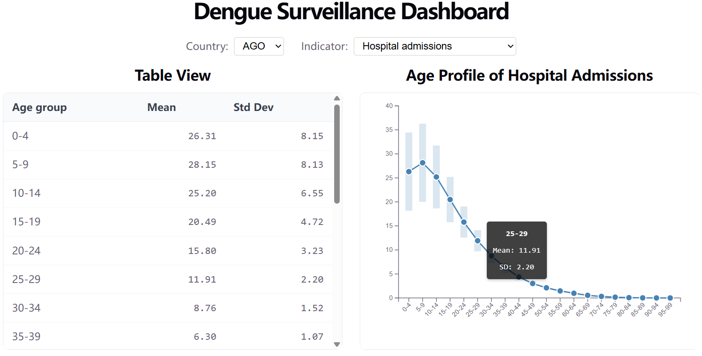
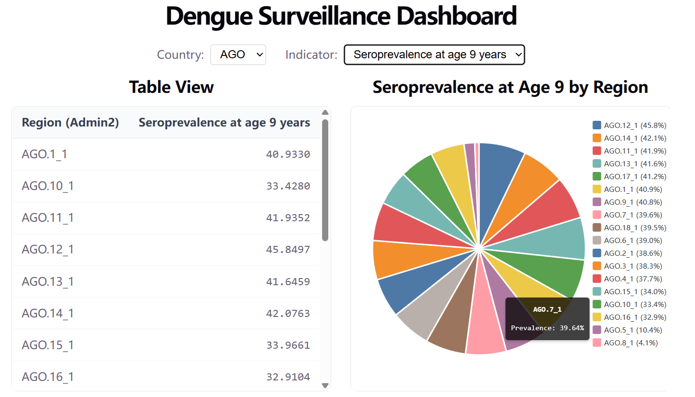
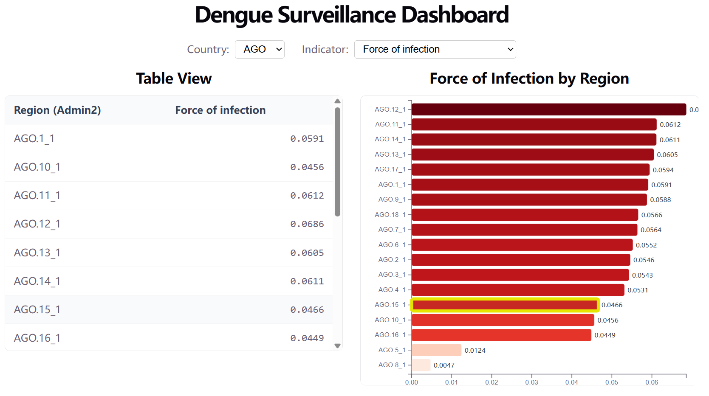

# Dengue Surveillance Dashboard

An interactive web application for visualizing dengue infection indicators (Force of Infection, Seroprevalence at age 9, and Hospital Admissions by age group) across regions. Built with **Svelte 5 (runes mode)** and **D3.js**, it dynamically adapts to changes in metadata and data, making it future-proof for new indicators or age groupings.

## Features

- **Dynamic Table View** – Automatically adjusts columns and rows based on the selected indicator and available metadata (age groups, regions).
- **Three Interactive Charts**:
  - *Hospital Admissions* – Age‑profile line chart with standard deviation shading.
  - *Force of Infection* – Horizontal heatmap (red intensity scales with infection risk).
  - *Seroprevalence at age 9* – Pie chart with color‑coded regions and hover tooltips.
- **Responsive & Adaptive** – Charts resize when the browser window changes; tables and charts align perfectly in a two‑column layout.
- **Region Highlighting** – Click any row in the Force of Infection table to highlight the corresponding bar in the heatmap.
- **No Hard‑coded Labels** – All UI text (indicator names, age groups, summary types) is read from the metadata file. Adding a new indicator or changing age groups updates the interface automatically.
- **Accessibility** – Proper ARIA roles and label associations for screen readers.

## Tech Stack

- **Frontend**: Svelte 5 (runes mode) + TypeScript
- **Visualization**: D3.js (scale generators, arc/pie, axis, color interpolation)
- **Build Tool**: Vite
- **Styling**: Custom CSS (no Tailwind)

## Project Structure

```
src/
├─ lib/
│  ├─ stores/
│  │  └─ appState.svelte.ts       # Global reactive state (Svelte 5 runes)
│  ├─ data/
│  │  ├─ exerciseData.json        # Provided dataset
│  │  ├─ exerciseMetadata.json    # Provided metadata
│  │  └─ dataStore.ts             # Imports and exports raw data
│  ├─ types/
│  │  └─ types.ts                 # TypeScript type definitions
│  ├─ components/
│  │  ├─ Controls.svelte          # Country & indicator selectors
│  │  └─ DynamicTable.svelte      # Dynamic table (age groups or regions)
│  └─ charts/
│     ├─ AgeChart.svelte          # Line chart with SD ribbon
│     ├─ ForceHeatmap.svelte      # Horizontal red heatmap
│     └─ SeroprevalenceChart.svelte # Pie chart
├─ App.svelte                     # Main layout (grid, conditional rendering)
├─ main.ts
└─ app.css
```


## Getting Started

### Prerequisites

- Node.js (v18 or later)
- npm

### Installation

1. Clone the repository:
   ```bash
   git clone https://github.com/yuleifan/dengue-surveillance-dashboard.git
   cd dengue-surveillance-dashboard

2. Install dependencies:
    npm install

3. Start the development server:
    npm run dev

4. Open your browser at http://localhost:5173.

## Screenshots

### 1. Hospital Admissions (Age Profile)
*Line chart showing mean hospital admissions per 100,000 population by age group, with standard deviation as shaded ribbon.*



### 2. Seroprevalence at Age 9
*ie chart displaying the proportion of 9‑year‑olds exposed to dengue in different regions (AGO).  
**Future enhancement:** The pie chart will be replaced with a 2D/3D geographical region map for better spatial insight.*



### 3. Force of Infection
*Horizontal heatmap of annual per‑capita infection risk across regions; colour intensity increases with risk.*
**Interactive:** Click any row in the adjacent table to highlight the corresponding bar in the heatmap.*


